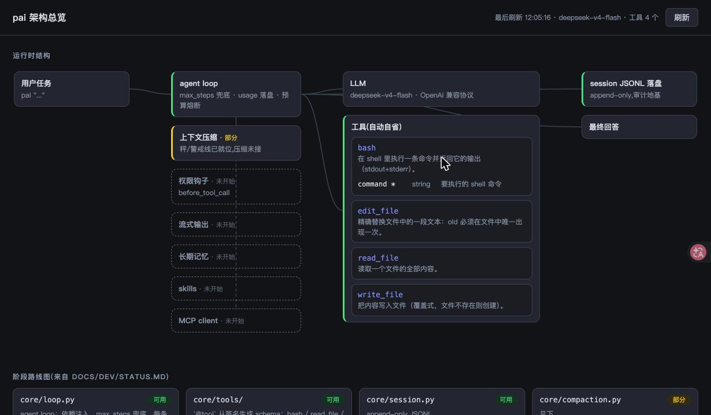
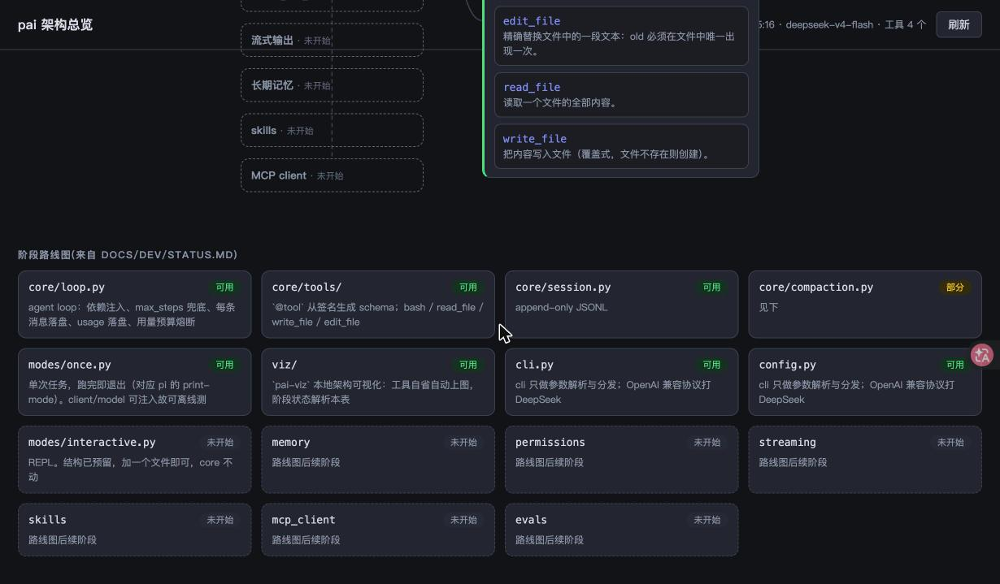

# pai

从零手写的最小编码 agent harness（Python）。架构参照精读 pi（github.com/earendil-works/pi，MIT）与对 Claude Code 的实现分析得出的设计，零代码依赖两者——所有实现都是独立写的，取舍见 docs/dev/decisions.md。

## 安装与运行

```bash
mkvirtualenv pai            # 本机统一用 virtualenvwrapper
cd ~/improve/coding/agent/projects/pai
pip install -e ".[dev]"
cp .env.example .env        # 填入 DEEPSEEK_API_KEY（或放 ~/.pai/.env，在任何目录都生效）

pai                         # 不带参数 → 交互模式 REPL
pai "在当前目录创建 hello.txt 写入 hello world 并读出来确认"   # 带任务 → 单次执行，跑完即退
```

交互模式里：`/help` 看命令、`/status` 看上下文与熔断状态、`/memory` 看加载了哪些指令文件、
`!命令` 直接跑 shell（不打模型）、行尾 `\` 续行、`Ctrl+C` 中断当前工作、`Ctrl+D` 退出。

测试（默认不打真实 API——花钱的副作用不能是默认行为）：

```bash
./test.sh              # 离线，276 passed
./test.sh --llm        # 额外跑真实 API 冒烟，会产生费用
```

架构可视化(本地网页，看运行时结构图与阶段路线图，改代码刷新即现)：

```bash
pai-viz                 # 默认端口 7777，自动打开浏览器
pai-viz --port 8080      # 换端口
pai-viz --no-open       # 不自动打开浏览器
```

必须在项目根目录运行——「阶段路线图」靠相对路径读 `docs/dev/STATUS.md`，不在根目录跑
不会报错，但该区域会为空并显示警告条(结构图部分不受影响)。

**运行时结构图**：agent loop 的数据流 + 工具卡片(从 `@tool` 注册表自动自省——新加一个
工具，刷新页面就出现，含参数 schema)。未来环节(压缩/权限/流式/记忆/skills/MCP)从第一
天就预画成虚线灰卡，状态跟 STATUS.md 联动，做完一块图上亮一块。点工具卡展开参数表：



**阶段路线图**：解析 STATUS.md「模块现状」表，绿=可用 / 黄=部分 / 灰=未开始。
STATUS.md 是唯一事实来源，更新表格即变色(viz 自己也在图里)：



## 数据存哪

pai 会在**用户目录**下留东西，不碰你的项目目录（布局对齐 Claude Code）：

```
~/.pai/
  .env                                  可选：放在这里的 key 在任何目录都生效
  PAI.md                                可选：用户级指令（所有项目都加载）
  history/<cwd 哈希>                     REPL 输入历史（↑/↓ 翻的就是它，按工作目录分）
  projects/-Users-you-path-to-proj/     一个项目一个目录，名字是可读的全路径
    memory/MEMORY.md                    自动记忆索引（模型用 remember 工具写）
    memory/<主题>.md                     主题笔记，按需读
    sessions/20260810-221805-36c2fc1a.jsonl   会话记录（每条带 sessionId 与 cwd）
```

项目里可以放 `PAI.md`（团队共享，进版本控制）与 `PAI.local.md`（个人，gitignore）——
从当前目录向上逐级加载，支持 `@path` 导入。

## 结构与阶段映射

模块按阶段切分，一个阶段一个模块；阶段定义与顺序以 docs/dev/roadmap.md 为准（本仓库唯一路线图），/code-check 按此验收：

```
src/pai/
  cli.py           命令行入口：只管参数解析与分发，不含业务逻辑
  config.py        env / client 工厂（OpenAI 兼容协议，默认 DeepSeek）
  core/            业务核心——不关心是单次执行还是 REPL
    loop.py        agent loop（依赖注入、事件流、双队列注入点、中断、压缩接线、预算熔断）
    events.py      结构化事件（frozen dataclass 扁平联合）+ 默认渲染器
    queue.py       steering / followUp 两条待注入消息队列
    interrupt.py   中断标志（Ctrl+C 只置标志，执行侧自己找地方收尾）
    paths.py       用户级路径唯一事实源：~/.pai/projects/<可读 slug>/{memory,sessions}
    session.py     JSONL 会话落盘（每条带 sessionId 与 cwd）
    compaction.py  上下文压缩（触发→切→摘→重建→熔断，已全链接进 loop）
    memory.py      分层指令加载（PAI.md）+ 自动记忆索引 + @path 导入
    tools/         工具系统：__init__.py 注册表 + @tool 装饰器
                   fs.py（原子写）/ shell.py（可中断到进程组）/ ask.py / memory_tool.py
    ── 以下按 roadmap 阶段生长（阶段号见 docs/dev/roadmap.md，此处不重复维护）──
    permissions.py before_tool_call 钩子 + 权限
    streaming.py   流式
    skills.py      skills
    mcp_client.py  MCP client
  modes/           交互形态——同一套 core，不同的进入与输出方式（学 pi 的 modes/）
    once.py        单次任务，跑完即退出（对应 pi 的 print-mode）
    interactive.py REPL：历史 / 续行 / `!` shell 模式 / `/` 命令 / 两级 Ctrl+C
    statusline.py  工具调用状态行（纯函数 render，按终端列宽算中文宽度）
  viz/             架构可视化：pai-viz 起本地网页，结构图（工具自动自省）+ 阶段路线图（解析 STATUS.md）
evals/             评测集与跑批
tests/             pytest；tests/fake_llm.py 是假 provider（学 pi 的 faux provider 模式）
test.sh            统一测试入口，默认不打真实 API
docs/dev/          开发记录：decisions（为什么这么选）/ devlog（做了什么）/ STATUS（现在到哪）/ TODO / roadmap（阶段地图）/ reviews
knowledge/         学习沉淀：官方文档精读、源码走读、方法论回流（索引与规约见 knowledge/README.md）
refs/              外部参考资料（DeepSeek 文档快照，不入库，用脚本生成）
```

## 已知缺口（刻意的，按路线图逐阶段补）

**没有权限确认**（模型说跑 `rm -rf` 就真跑，阶段 4）、**没有流式**（阶段 5）、
**没有 TUI**（阶段 2 后半程，所以没有「点一下展开」这类交互）、
**没有 skills / MCP**（阶段 6）、**没有评测集**（阶段 7）、**没有会话恢复**（`--resume`）。

每补一块，在 `docs/dev/decisions.md` 记一条「pi/CC 怎么做的、我怎么做的、为什么」；
每个需求一个档案在 `docs/dev/features/`（需求→方案→拍板问答→红绿数字→复盘），
待办唯一入口是 `docs/dev/TODO.md`，用户提的想法先进 `docs/dev/需求池.md`。
