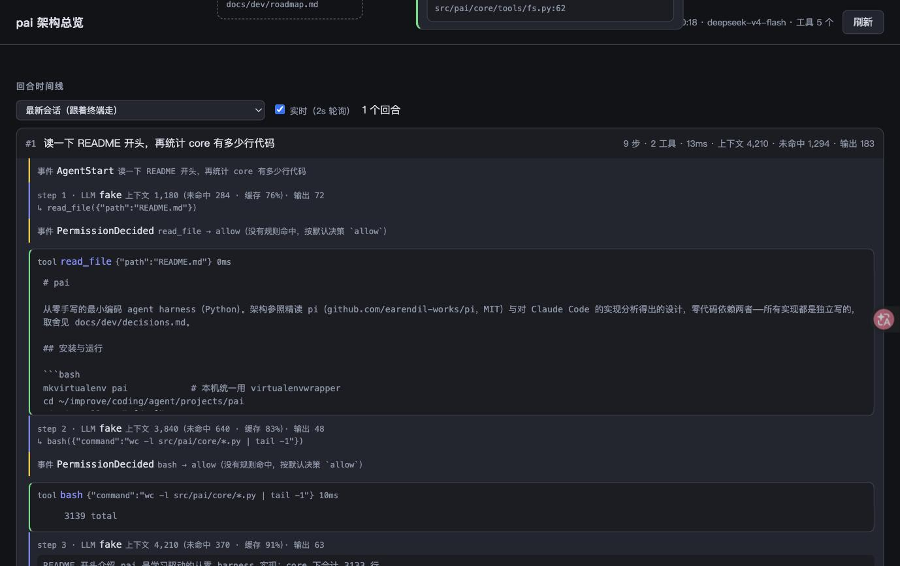

# pai

从零手写的最小编码 agent harness（Python，目标运行期 3.9+）。架构参照精读
pi（github.com/earendil-works/pi，MIT）、对 Claude Code 的实现分析、以及
deepseek-harness（github.com/deepseek-ai/deepseek-harness，MIT）得出的设计，
零代码依赖三者——所有实现都是独立写的，取舍见 docs/dev/decisions.md。

功能全貌：agent loop（流式、并发工具调度、预算熔断）、上下文自动压缩、
REPL 与整屏 TUI（鼠标、选区、输入折行）、分层指令与自动记忆（含按查询召回）、
权限三态与工作目录边界、skills（渐进式披露）、MCP client（stdio）、
会话落盘与 `--resume`、回放评测与真模型冒烟（`./eval.sh`）、
本地可视化（`pai-viz`）。

## 安装与运行

```bash
python3 -m venv .venv && source .venv/bin/activate   # 或 mkvirtualenv pai
pip install -e ".[dev]"
cp .env.example .env        # 填 DEEPSEEK_API_KEY（或放 ~/.pai/.env，任何目录都生效）

pai                         # 不带参数 → 交互模式（真终端进 TUI，管道/CI 退回纯 REPL）
pai "在当前目录创建 hello.txt 写入 hello world 并读出来确认"   # 带任务 → 单次执行
```

命令行参数：

```
pai [任务] [--max-steps N] [--max-tokens N] [--no-session]
    [--resume [ID或路径]] [--permission-mode MODE] [--dangerously-skip-permissions]
```

- `--max-tokens`：本次任务的累计 token 预算，超过即停（默认 200000，0 = 不限）——
  平台侧没有消费限额，这是唯一的自动烧钱熔断。
- `--resume`：恢复会话接着聊（交互模式）。不带参数 = 本项目最近一次；
  也可给会话 id 前缀或会话文件路径。
- `--permission-mode`：`default` / `acceptEdits` / `dontAsk` / `bypassPermissions`
  （默认读 settings.json 的 `defaultMode`；见下方「权限与安全」）。
- `--dangerously-skip-permissions`：等价 `bypassPermissions`。deny 规则、
  显式 ask 规则与危险写清单**仍然生效**。

模型与端点用环境变量换（`.env` 或 `~/.pai/.env`）：

```bash
DEEPSEEK_API_KEY=sk-...
PAI_BASE_URL=https://api.deepseek.com   # 任何 OpenAI 兼容端点都行
PAI_MODEL=deepseek-v4-flash
PAI_RECALL_MODEL=...                    # 可选：记忆召回的侧查询用便宜模型
PAI_CONTEXT_WINDOW=1000000              # 可选：上下文窗口（压缩触发的分母）
```

## 交互模式

真终端下是整屏 TUI（上方滚动 transcript、下方 pai 接管的 dock）；
管道 / CI / 注入输入时自动退回纯行式 REPL，行为一致。

```
/help         命令表
/status       上下文估算、锚点数、压缩熔断状态
/memory       本次加载了哪些指令文件 + 自动记忆目录
/mode         查看/切换权限模式（TUI 里 shift+tab 轮转）
/permissions  当前生效的权限规则、来源、危险写清单与 bash 边界提示
/compact      手动压缩当前对话
/skill        列出可用 skills；`/skill <名> [参数]` 加载并执行
/clear        清空对话（保留 system）
/exit         退出（等同 Ctrl+D）
!命令          直接跑 shell，不打模型
行尾 \        续行
```

键位与鼠标（TUI）：`Ctrl+C` 两级中断（干活时打断当前轮，空闲时第一次清输入、
第二次退出）；`shift+tab` 轮转权限模式；`Ctrl+O` 展开/收起最近的工具结果；
`Ctrl+L` 重画；滚轮滚 transcript、拖选自动进剪贴板、点击输入行定位光标
（长行折行后点续排行也定位正确）；折行/多行输入里 `↑`/`↓` 先在显示行间移动
光标，到顶/到底才翻历史。**干活期间打的字不会丢**：默认本轮就注入（模型立刻
看到），排队数量在状态行可见。

## 权限与安全

三态规则 + 工作目录边界，求值顺序 `deny → ask → allow`，第一个匹配决定；
没有规则命中时走边界兜底：读界内放行、读界外问、写一律问。四种模式：

| 模式 | 行为 |
|---|---|
| `default` | 按规则与边界，需要确认就问真人（单次模式无人可问 → 拒绝） |
| `acceptEdits` | 界内写免确认，其余同 default |
| `dontAsk` | 一切需要确认的直接拒绝（单次模式的默认） |
| `bypassPermissions` | 兜底放行；deny / 显式 ask / 危险写**免疫**，仍然拦 |

两句必须知道的真话（`/permissions` 里也会显示）：

- bash 不参与工作目录边界：给 bash 配了 allow 白名单（如 `Bash(cat *)`），
  白名单内的命令就能越界读写任何路径。
- 危险写清单永远确认、任何模式翻不过：shell 配置文件（`.bashrc` 等）、
  `~/.ssh/`、任意 `.git/hooks`、任意 `.pai/skills`、任意 `.pai/settings.json`。

## settings.json 参考

两层：`~/.pai/settings.json`（用户级）与 `<项目>/.pai/settings.json`
（项目级，同名段项目赢；权限规则是两层追加不覆盖）。全部键：

```jsonc
{
  "permissions": {
    "allow": ["Bash(ls *)", "read_file(/docs/**)"],   // 工具名(说明符)；裸工具名也行
    "ask":   ["Bash(git push *)"],                    // 显式 ask：bypass 下仍然问
    "deny":  ["Bash(rm -rf *)", "write_file"],        // 裸名 deny 的工具不摆给模型
    "defaultMode": "default",                         // 见上表；once 模式用不上时会告警
    "additionalDirectories": ["~/notes"]              // 边界的额外允许根
  },
  "tests": {                                          // run_tests 工具用
    "command": "./test.sh",                           // 不配则自动探测（test.sh / pytest /
    "timeoutSeconds": 600                             //   npm test / cargo test / go test）
  },
  "hooks": {
    "PreToolUse": [                                   // 外部命令门禁：退出码 0 放行、
      { "matcher": "Bash",                            // 2 拦下、其他不表态；崩溃/超时
        "hooks": [{ "type": "command", "command": "python3 guard.py" }] }   // = 拦下
    ]
  },
  "bash": { "timeoutSeconds": 120 },                  // bash 默认超时（1..600；模型可传
                                                      // timeout 参数覆盖，上限 600 真钳制）
  "tui": { "altScreen": true, "mouse": true },        // 整屏/鼠标开关（个别终端不兼容时关）
  "mcpServers": {                                     // 见「MCP」节
    "docs": { "command": "python3", "args": ["server.py"],
              "env": {"K": "V"}, "timeout": 60000 }
  }
}
```

路径说明符的锚点：用户层规则里的 `/x/**` 锚在 `~/.pai/`，项目层锚在项目根；
`~/` 展开家目录；裸文件名匹配任意深度。

## 指令与记忆

- 分层指令：`~/.pai/` 下的 `AGENTS.md` / `PAI.md`（用户级）→ 项目根到当前
  目录沿途的 `AGENTS.md` / `PAI.md` / `PAI.local.md`（个人，建议 gitignore），
  支持 `@path` 导入；同目录内后读到的更靠近对话（`PAI.md` 压得住 `AGENTS.md`）。
  压缩后自动从磁盘重读重注入，长会话里指令不失效；会话中途改了文件用
  `/memory reload` 让它下一轮生效。读 `AGENTS.md` 是 2026-08-26 的复议结论：
  pai 要在别人的项目里跑，那份文件就是那个项目写给 agent 的规矩。
- 路径作用域规则（`.pai/rules/*.md`、`~/.pai/rules/*.md`）：带 `paths:`
  frontmatter 的规则只在模型这一步真的碰到匹配文件时才进上下文，碰不到就
  一个字都不占——用来把「越写越长的 PAI.md」拆开，降低常驻成本。

  ```markdown
  ---
  paths: web/**, docs/*.md
  ---

  这两处的规矩：…
  ```

  `paths` 也可以写成 YAML 列表（`- web/**` 一行一条）。`**` 跨目录、
  `*`/`?` 不跨 `/`、`docs/` 这样的目录名匹配它之下的一切。
  不带 `paths:` 的文件不加载并告警——要常驻就写进 `PAI.md`。
  `bash` 里的 `cat` 不算「碰到文件」（bash 不参与路径判定，与目录边界同一条
  取舍）。`/memory` 能看到有哪些规则、各自的 `paths`、以及本会话注入了哪些。
- 自动记忆：模型用 `remember` 工具一事一文件写进
  `~/.pai/projects/<项目>/memory/`，索引自动重建；每轮一次侧查询按当前任务
  召回 ≤5 篇注入（失败会明说，连续失败自动停用）。

## skills

一个 skill = 一个目录包 `<名字>/SKILL.md`（或扁平 `<名字>.md`）：

```markdown
---
name: code-review
description: 按团队规范做代码评审（模型按这句话决定何时使用）
---
这里是正文：只在被加载时进入上下文（渐进式披露，目录常驻、正文按需）。
```

放两处任一：`~/.pai/skills/`（用户级，跟人走）或 `<git根>/.pai/skills/`
（项目级，进版本库）。同名项目级赢。frontmatter 加
`disable-model-invocation: true` 则模型不可自主调用、只有 `/skill` 显式通道。
项目级 skills 有信任门禁：首次遇到会请你确认（skills 会指挥模型行为，
只信任 review 过的）；单次模式无人可问则不加载并提示。写入任何 `.pai/skills`
永远需要确认——写 skill 等于拿到后续会话的指挥权。

## MCP

settings 的 `mcpServers` 段配置 stdio server（v1 只有 stdio 传输）：工具以
`mcp__<server>__<工具名>` 进模型工具集，默认走确认（`allow: ["mcp__docs__*"]`
可整 server 放行）。server 起不来 / 中途死 / 超时 / 返回错误都不会连累会话，
失败的 server 会在指令里告知模型「别再调它的工具」。项目级 server 配置
与 skills 同款信任门禁。工具描述与输出有预算与 Unicode 清洗（外部内容不可信）。

## 数据存哪

pai 只写用户目录，不碰你的项目目录（布局对齐 Claude Code）：

```
~/.pai/
  .env                     可选：任何目录都生效的环境变量
  AGENTS.md / PAI.md       可选：用户级指令（两个都读，PAI.md 更靠近对话）
  settings.json            可选：用户级设置（见上）
  skills/                  用户级 skills
  rules/                   用户级路径作用域规则（*.md，带 paths: frontmatter）
  history/<cwd 哈希>        REPL 输入历史（按工作目录分）
  projects/<可读路径 slug>/
    skills_trusted / mcp_trusted     项目级信任标记（不进仓库，塞不进来）
    memory/                自动记忆（MEMORY.md 索引 + 一事一文件）
    sessions/<时间戳-id>.jsonl           会话记录（--resume 读它；审计流）
    sessions/<同名>.events.jsonl         harness 事件（pai-viz 用；可再生）
```

## 测试与评测

```bash
./test.sh              # 全部离线（假模型/假 provider/假 MCP server），默认不花一分钱
./test.sh --fast       # 跳过 pty e2e 的快循环（约 4 倍快）；交付前仍要跑全量
./test.sh -n auto      # 并行（可选，观察期中，默认串行）
./test.sh --llm        # 追加打真实 API 的冒烟，会产生费用（需 key + 显式开关）

./eval.sh              # 评测：真轨迹回放（无密钥、确定性，判分走外部世界断言）
./eval.sh --llm        # 追加真模型评测；工件落 evals/.eval/<时间戳>/runs.jsonl
```

准确的测试数字以 docs/dev/STATUS.md 为准（那里有机器对账，README 不抄数字
——抄了必漂）。

## 可视化（pai-viz）

```bash
pai-viz                 # 本地网页，默认端口 7777；--port 换端口，--no-open 不自动开浏览器
```

页面纯观察，无对话输入。三块：运行时结构图（工具卡片从 `@tool` 注册表自省，
每处标 `file:line` 可点开编辑器）、回合时间线（终端里跑 pai，浏览器 2 秒内
自己长出新回合，含权限判定/压缩/召回/熔断等 harness 内部事件，会话可回放）、
阶段路线图（解析 STATUS.md，绿=可用）。




另有 `pai-replay <录制文件> -o 图.png`：配合 `PAI_TUI_RECORD=<路径>` 录下的
终端字节回放成 PNG（让 AI 自己看得见界面）。

## 结构

模块按学习阶段切分（阶段定义见 docs/dev/roadmap.md），核心边界两条：
工具错误不 throw（转字符串回填）、新模块只依赖事件与注入回调不 import loop 内部。

```
src/pai/
  cli.py / config.py    入口与 env/client 工厂（OpenAI 兼容协议）
  core/
    loop.py             agent loop：流式、按批工具调度、压缩接线、预算熔断、截断防护
    events.py           结构化事件（frozen dataclass 联合）+ 默认渲染器
    streaming.py        流式装配（tool_calls 按 index 归并、usage 每块都看）
    scheduler.py        保序贪心分批：连续并发安全工具并行，其余串行
    compaction.py       上下文压缩：触发→切→摘→重建→熔断（锚定真实 usage）
    session.py          会话格式 v1 落盘 / 加载 / 重建 / 回放（--resume 的地基）
    trace.py            观测流：harness 事件落 .events.jsonl（pai-viz 用）
    memory.py / recall.py       分层指令 + 自动记忆 + 按查询召回
    permissions.py / boundary.py / hooks.py / gate.py   三态规则 / 目录边界与危险写 / 外部门禁 / 装配
    settings.py         两层 settings.json 统一读取 + 通用信任门禁
    skills.py           skills：扫描 / 目录渲染 / 正文加载 / 压缩后重挂
    mcp.py              MCP client：stdio JSON-RPC、工具桥接、清洗与预算
    queue.py / interrupt.py     排队消息 / 进程级中断标志
    tools/              @tool 注册表；bash / read_file（可按行 offset/limit 分段）/
                        search_files（内容正则 + 文件名 glob，参与目录边界）/
                        run_tests（命令来自设置或探测，模型不能指定跑什么）/
                        git_read（只读子命令，argv 不过 shell）/
                        write_file / edit_file / ask_user_question / remember / skill
                        output.py 是输出上限与「保头保尾」的家
  modes/
    assembly.py         once 与 interactive 共用的装配序列（一份实现）
    once.py             单次任务；interactive.py  REPL 与 TUI；echo.py / statusline.py 输出
  tui/                  只有 renderer/altscreen/terminal 碰终端，其余纯函数或纯状态机：
                        component / keys / editor（折行）/ arbiter（输入归属）/ dialog /
                        dock / transcript / scroll / selection / mouse / clipboard /
                        sanitize / screen（模拟器）/ record / replay / theme / logo / app / driver
  evals/                评测的可复用逻辑：runs.jsonl 工件索引、轨迹→回放脚本派生
  viz/                  pai-viz 网页与数据装配
evals/                  评测套件本体（./eval.sh 跑；fixtures/ 是签入的真实轨迹）
tests/                  pytest 全离线；fake_llm（注入式假客户端）与 fake_provider
                        （真 HTTP 假服务）分工是硬的，另有 fake_mcp_server
docs/dev/               开发记录：decisions / devlog / STATUS / TODO / roadmap / features 档案
knowledge/              学习沉淀（pi / CC / dsh 三家对照精读）
```

## 已知问题（真话，全部登记在 docs/dev/TODO.md）

- bash 不参与工作目录边界（见「权限与安全」）——这是权限功能的主要失效模式，
  刻意取舍（CC 靠分类器模型解决，pai 不做分类器）。
- TUI 拖选在某些真机上卡顿，成因未确诊（离线复现不了）；pty e2e 偶发挂死
  （测试基建问题，不影响使用）。
- 压缩阈值、skills/MCP 的预算常量是从参照实现借的经验值，未经真实使用校准。
- 会话中途增删 skill 不生效（装配期扫描一次）；MCP 仅 stdio 传输、无重连。

## 开发记录去哪看

`docs/dev/STATUS.md`（现在到哪）、`decisions.md`（为什么这么选）、
`devlog.md`（做了什么）、`features/`（一个需求一个档案：需求→拍板问答→
红绿数字→复盘）、`TODO.md`（待办唯一入口）。每与 pi/CC/dsh 不同的取舍
都有编号决策可查。
